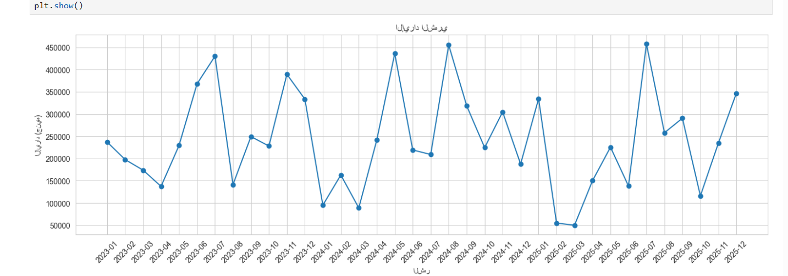
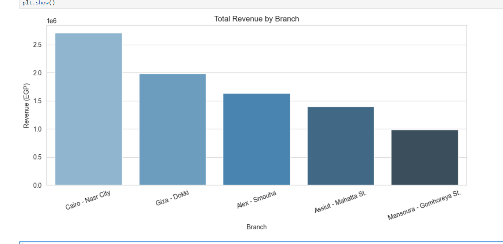
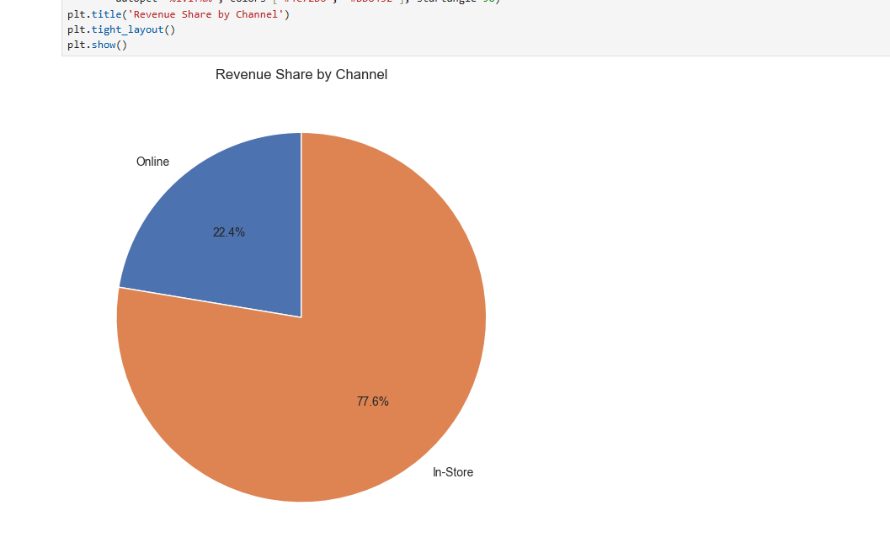
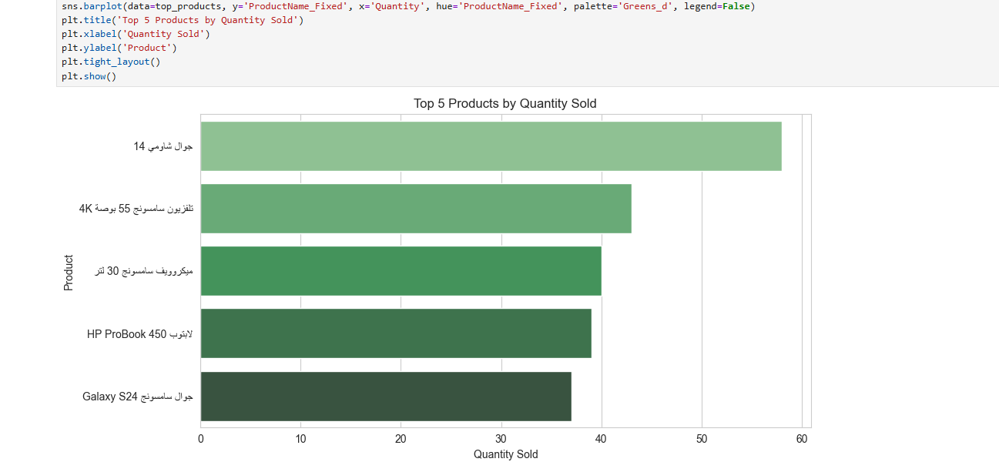

# Al Nakheel Trading Co. — Sales Data Cleaning & Analysis

Practice project: take a deliberately messy retail sales dataset (Excel
export, ~300 orders, 6 branches) and turn it into a clean, analysis-ready
SQL Server data warehouse, then analyze it (SQL + Python).

## Approach: ELT (Extract → Load → Transform)
Raw data is loaded exactly as-is into a staging table first, then cleaned
*inside* the database with SQL. This keeps a full record of the original
data at all times and makes cleaning logic transparent and re-runnable.

```
Excel (raw) → Sales_Staging (raw, untouched) → cleaning queries → FactSales (clean)
```

## Project structure
```
sql/
  01_setup/        -- create schema, load raw data (staging + dimensions)
  02_cleaning/      -- explore & fix data quality issues, build FactSales
  03_analysis/      -- business-question queries (Day 2)
python/
  al_nakheel_analysis.ipynb -- EDA & visualization on the cleaned data (Day 3)
  charts/           -- exported PNG charts (generated by the notebook)
docs/
  day1_decisions.md -- documented business decisions behind cleaning rules
  day2_findings.md  -- headline analysis findings from Day 2
```

## Data quality issues found & fixed
- **Branch names**: ~25 raw text variants for 6 real branches (inconsistent
  spacing, optional "فرع" prefix, hamza spelling, separators). Fixed with a
  progressive text-normalization pipeline + keyword matching — see
  `sql/02_cleaning/07_clean_branch_names.sql`.
- **Missing `Quantity`**: backfilled from `TotalAmount / UnitPrice` where
  derivable.
- **Zero/NULL `TotalAmount`** (mostly cancelled orders): recalculated as
  `Quantity × UnitPrice`.
- Full reasoning for each decision: `docs/day1_decisions.md`.

## How to run
1. Run scripts in `sql/01_setup/` in order (01 → 05) to create the DB and
   load raw data.
2. Run scripts in `sql/02_cleaning/` in order (06 → 09) to explore, clean,
   and build the final `FactSales` table.
3. Run business-question queries in `sql/03_analysis/`.
4. Open `python/al_nakheel_analysis.ipynb` in Jupyter and run all cells.

   **Before running:** the connection cell has `server = 'YOUR_SERVER_NAME'`
   — this is a placeholder, not a real value. Replace it with your own SQL
   Server instance name (found in SSMS's "Server name" box, e.g. `localhost`
   or `YOURPC\SQLEXPRESS`). A real server name is specific to the machine
   it's running on, so it's intentionally not committed here — anyone
   cloning this repo needs to put in their own.

   Charts are saved to `python/charts/`.

## Charts
| Monthly Revenue | Revenue by Branch |
|---|---|
|  |  |

| Channel Split | Top Products |
|---|---|
|  |  |

*(Generated by running the notebook — regenerate by re-running all cells.)*

## Tech stack
SQL Server (T-SQL) for data cleaning & analysis, Python (pandas,
matplotlib/seaborn) for further analysis and visualization.
